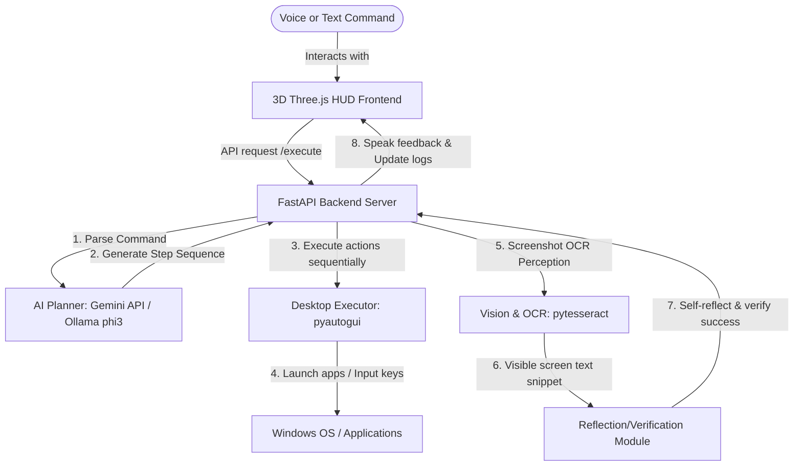

# 🌌 AURA – Voice Controlled Autonomous Desktop AI Assistant

AURA is a premium, next-generation **Autonomous Voice-Controlled Desktop AI Assistant**. Featuring a stunning 3D holographic interface powered by Three.js, active speech-to-text/text-to-speech, screen perception (OCR), a vector-backed long-term memory, and self-reflecting execution loops, AURA acts as an autonomous agent that can navigate and control your desktop operating system.

> [!NOTE]  
> Because AURA uses **PyAutoGUI** to control your real mouse, keyboard, and launch desktop applications, the **automation backend must run on your local machine** (or a machine you want to control). 
> However, you can host the **Frontend dashboard on the cloud for free** and connect it to your local PC remotely, or expose your local AURA backend to the web using a secure free tunnel (e.g., **ngrok**) to voice-control your desktop from your mobile phone or laptop anywhere in the world!

---

## 🎨 Core Architecture & Advanced Features



* **🤖 Smart Dual-LLM Planner:** Leverages cloud-based **Google Gemini 1.5 Flash** (via high-speed JSON schemas) with local **Ollama (Phi-3)** fallback.
* **👁️ Screen Perception (Vision & OCR):** Uses screenshots and `pytesseract` to read and understand your screen dynamically.
* **🧠 Self-Correcting Reflection Module:** Captures the screen post-execution, reviews the visual output, and validates if the task actually succeeded—preventing false positives.
* **🎙️ Voice Activated (Wake Word):** Features continuous speech recognition with native web speech APIs and fallback local model listeners (`vosk`) to listen to wake commands (e.g., *"Hey AURA"*).
* **🧠 Vector Memory System:** Integrated SQLite and FAISS semantic memory to remember past commands and interactions.
* **⚙️ SaaS Multi-User Connection Panel:** Allows any visitor to visit your live hosted Netlify dashboard, click the ⚙️ settings icon, enter their own backend API URL (like `http://127.0.0.1:8000/api`), and control their own local computer!
* **🎭 Offline Demo/Simulation Mode:** Automatically boots into a beautiful, fully functional demo mode if your backend server is offline, simulating the AI planning and execution sequence so visitors can experience the UI seamlessly.
* **🔌 One-Click Background Launchers:** Includes `run_aura_remote.bat` for instant server & ngrok tunnel startup on your static domain, and `run_aura_hidden.vbs` to run the entire backend silently in the background with zero terminal clutter.

---

## 🚀 1. Free Deployment & Cloud Hosting Guides

To deploy this entire project for free, we split it into **two free tiers**:

### 🌐 Tier A: Host the 3D Holographic Frontend (100% Free on Netlify/Vercel)
You can deploy the gorgeous 3D frontend interface on a global edge CDN for free.

1. **Deploying on Netlify (Easiest)**:
   * Create a free account on [Netlify](https://www.netlify.com/).
   * Click **Add new site** > **Deploy manually**.
   * Drag and drop the `frontend/` folder into the Netlify dashboard.
   * *Alternatively*, push your code to GitHub and connect it to Netlify for automatic CI/CD deployments.
   
2. **Deploying on Vercel**:
   * Install the Vercel CLI: `npm install -g vercel`
   * From your terminal in the `frontend` folder, run `vercel` and follow the prompts.

3. **Connecting to your Local Backend**:
   * Once deployed, your frontend will search for the backend at `http://127.0.0.1:8000/api`.
   * To connect a remote frontend to your local computer, configure a secure tunnel (see Tier B).

---

### 🛡️ Tier B: Expose your Local Desktop Backend to the Web (100% Free Tunnel)
If you want to control your desktop computer remotely using your phone or a remote frontend link, you can create a secure tunnel directly to your local FastAPI backend.

1. **Install ngrok** (Free secure tunnels):
   * Sign up for a free account at [ngrok.com](https://ngrok.com/) and copy your Authtoken.
   * Download and install ngrok.
2. **Configure your Token**:
   ```bash
   ngrok config add-authtoken YOUR_AUTHTOKEN
   ```
3. **Launch the Tunnel**:
   ```bash
   ngrok http 8000
   ```
   *ngrok will generate a secure public HTTPS URL (e.g., `https://abcd-12-34.ngrok-free.app`).*
4. **Update Frontend API Endpoint**:
   * Change the `API_BASE` variable in `frontend/main.js` from `http://127.0.0.1:8000/api` to your new ngrok HTTPS URL. Now you can control your local computer from any device anywhere!

---

## 💻 2. Local Setup & Installation

Follow these steps to set up the automation backend on your target desktop machine:

### Prerequisites
* **Python**: Install Python 3.10 or later.
* **Tesseract OCR**: 
  * Download the installer for Windows: [UB-Mannheim Tesseract](https://github.com/UB-Mannheim/tesseract/wiki).
  * Add the path (e.g., `C:\Program Files\Tesseract-OCR`) to your system environment variables.
* **Gemini API Key (Recommended for Free Cloud Planning)**:
  * Get a free developer API key from [Google AI Studio](https://aistudio.google.com/).
  * This enables blazing-fast planning and verification without consuming your local CPU/GPU!

### 🔧 Step-by-Step Local Setup

1. **Clone the Repository & Navigate to Project**:
   ```bash
   cd "aura-ai-assistant"
   ```

2. **Create and Activate a Virtual Environment**:
   ```bash
   python -m venv venv
   # Activate on Windows:
   venv\Scripts\activate
   # Activate on macOS/Linux:
   source venv/bin/activate
   ```

3. **Install Core Dependencies**:
   ```bash
   pip install -r requirements.txt
   ```

4. **Configure Environment Variables**:
   Create a `.env` file or set variables in your terminal:
   ```cmd
   # On Windows Command Prompt:
   set GEMINI_API_KEY=your_free_gemini_api_key
   
   # On Windows PowerShell:
   $env:GEMINI_API_KEY="your_free_gemini_api_key"
   ```

5. **Local AI Fallback (Optional - Ollama Setup)**:
   If you want a 100% offline fallback planner:
   * Install [Ollama](https://ollama.com).
   * Pull the target model: `ollama pull phi3`
   * Keep Ollama running in the background (`ollama serve`).

6. **Run the Assistant Backend**:
   ```bash
   python run_aura.py
   ```
   *Open `http://localhost:8000` in your web browser to access the 3D dashboard!*

---

## 🎮 3. Try These Voice/Text Commands!

Once AURA is running, type or speak these commands:

* **Simple Desktop Actions:**
  * *"open notepad"* (Checks if Notepad process starts successfully)
  * *"screenshot"* (Takes a screenshot automatically)
  * *"volume up"* / *"mute"* (Performs system volume adjustments)
* **Smart Compound Commands (Zero Code Modifications Required!):**
  * *"open notepad and type Hello AURA, then press enter and type I love AI"*
  * *"open chrome and search for space wallpapers"*
* **Self-Verifying Screen Actions:**
  * *"open paint and write hi"* (Launches Paint, writes "hi", then takes a screenshot to verify "hi" actually appeared on screen!)
