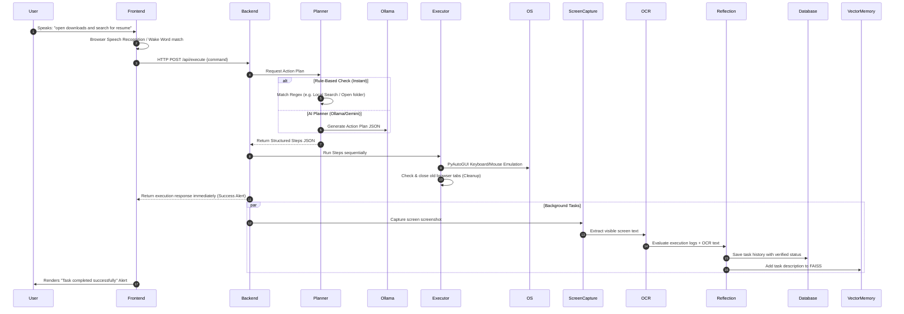

# AURA: Autonomous Voice-Controlled Desktop AI Assistant

Welcome to the official technical presentation guide for **AURA** (Autonomous Core v2). This document explains the architecture, tech stack, background processes, step-by-step workflow, and a professional demo script for presenting this project.

---

## 1. Project Overview
AURA is a voice-controlled autonomous desktop AI assistant that bridges the gap between natural language commands (spoken or typed) and physical desktop automation. It combines:
- **Local AI planning** (running offline LLMs).
- **Computer Vision & OCR** (to visually verify task success).
- **Proactive desktop automation** (automating mouse, keyboard, and system tasks).
- **Interactive 3D UI HUD** (Heads-Up Display with live telemetry and 3D visualizer).

---

## 2. Technical Stack

### Frontend (User Interface)
- **HTML5 & Vanilla CSS3**: Implements a sleek, premium dark-mode interface with glassmorphism, ambient glowing highlights, custom scrollbars, and telemetry meters.
- **JavaScript (ES6+)**: Handles Web Speech API, asynchronous API polling, connection modal configurations, and dynamic HUD updating.
- **Three.js**: Renders the dynamic 3D visualizer orb representing AURA's cognitive state (e.g., listening, thinking, executing).
- **Web Speech API**: Performs real-time local speech-to-text in the browser with custom wake-word matching ("Hey Aura").

### Backend (Core Engine)
- **FastAPI (Python)**: A high-performance, asynchronous web framework serving API endpoints for execution, system statistics, and history.
- **Uvicorn**: Asynchronous ASGI web server.
- **SQLite3**: Relational database storing task histories, execution logs, and statuses.
- **FAISS & Vector Memory**: Vector database storing memory embeddings for semantic context search.

### AI & Automation Engines
- **Ollama (Local LLM - e.g., Phi-3)**: Runs offline on the host machine to generate structured JSON execution plans.
- **Google Gemini API**: Serves as a fallback planner and powers the **Self-Reflection** module.
- **PyAutoGUI**: Simulates mouse movement, clicking, keyboard typing, and hotkeys.
- **EasyOCR / Screen Capture**: Captures the host screen and extracts visible text to verify that the GUI reflects successful execution.

### Voice & Telemetry
- **Edge TTS & Pygame Mixer**: Generates high-quality neural voice speech output and plays it using pygame audio buffers.
- **pyttsx3**: Offline fallback Text-to-Speech engine.
- **psutil**: Captures real-time host CPU and RAM telemetry for the frontend dashboard.

---

## 3. Background Architecture & Workflow

The diagram below illustrates how AURA processes a command:



---

## 4. How Modules Work in the Background

### A. Voice Architecture
1. **Wake Word Detection**: The browser continuously listens in a passive loop. When it hears "Hey Aura" or "Aura", it plays a soft chime and starts active command listening.
2. **Speech-to-Text**: Web Speech API captures your command and populates the input field. If browser speech fails, it falls back to a backend microphone capture using Vosk.
3. **Text-to-Speech (Edge TTS)**: Text is sent to Microsoft's neural network to generate natural voice files (.mp3) saved temporarily, played using `pygame.mixer`, and deleted safely.

### B. The AI Planner
1. **Rule-Based Bypass**: Checks if a command matches native patterns (like opening folders or searches). If matched, it bypasses the LLM completely, bringing response latency down to **0.1 seconds**.
2. **AI Action Planning**: If complex, it prompts the LLM to return a JSON array containing structured steps. For example:
   ```json
   [
     {"action": "open_app", "app": "chrome"},
     {"action": "wait", "seconds": 2},
     {"action": "navigate_url", "url": "https://google.com"}
   ]
   ```

### C. Desktop Executor
1. **pyautogui.FAILSAFE**: Safety mechanism. If AURA goes out of control, moving the mouse cursor to any corner of the screen immediately halts execution.
2. **Process Polling**: When launching apps (e.g., Chrome), it checks `psutil` process list for up to 4 seconds to verify the process actually started.
3. **Tab Cleanup**: Tracks open browser tabs. When a new browser task finishes, AURA presses `ctrl+shift+tab` to focus the old tab and `ctrl+w` to close it, keeping the user's workspace clean.

### D. Vision & Self-Reflection
1. **Screen Capture**: Saves a temporary PNG of the host screen.
2. **OCR Parsing**: Extracts text from the screenshot using optical character recognition.
3. **Self-Reflection**: Sends the User Command, Step Logs, and OCR Text to Gemini. Gemini verifies if the visual state matches the command (e.g., if the user asked to open Notepad, is the word "Notepad" visible on the screen?). It updates the SQLite database with the verified success state in the background.

---

## 5. How to Present the Project (Demo Script)

Follow this structured script to deliver a wowing presentation to evaluators or viewers.

### Phase 1: The Setup & HUD introduction
1. **Start the backend**:
   ```bash
   python run_aura.py
   ```
2. **Open the browser** at `http://127.0.0.1:8000`.
3. **Point out the HUD Dashboard**:
   - *"On the left, we have the Voice Architecture controls, where we can tap to speak or toggle the wake word listener."*
   - *"In the center, we have the 3D WebGL Orb visualizer rendered using Three.js, which reactively spins, pulses, or glows depending on AURA's state (Idle, Listening, Thinking, Executing)."*
   - *"On the right, we have live Telemetry meters showing host CPU load and RAM usage in real-time, along with live system logs."*

### Phase 2: Simple Automation (Fast Response)
1. Type or say: **"open downloads"**
2. **Observe**: The Downloads folder opens in File Explorer instantly. Show the evaluator the log on the right side: `Execution SUCCESS`.
3. Say: **"open chrome and search for AI news"**
4. **Observe**: Chrome opens, navigates to Google Search for "AI news".

### Phase 3: Tab Cleanup & Fast Search
1. Say: **"open chrome and search for weather"**
2. **Observe**:
   - Chrome opens a new tab and searches for weather.
   - Immediately after completion, AURA automatically navigates to the old tab (AI news) and closes it, leaving your browser tidy.
   - Point out that the completed alert appeared instantly because reflection is offloaded to the background.

### Phase 4: Local Search and File Opening (The Climax)
1. Say: **"open downloads and open Chandan A N MCA Details"**
2. **Observe**:
   - AURA opens CMD and lists matching files using `dir /s`.
   - AURA opens File Explorer and inputs the search query.
   - AURA recursively scans the Downloads folder in the background, locates the actual file (`Chandan A N MCA Details.pdf`), and opens it directly on the screen!

---

## 6. Key Innovations to Highlight during Q&A
1. **Zero-Latency Planning**: Uses a hybrid rule-based + LLM planner to execute simple directory/app tasks in milliseconds while reserving LLMs for complex reasoning.
2. **Self-Healing Tab Counter**: Automatically polls `psutil` process lists to count active browser instances and clean up tabs without losing user state.
3. **Visual Reflection Verification**: Unlike blind script automation, AURA captures screenshots and runs OCR to verify that the target application is actually rendered on screen.
